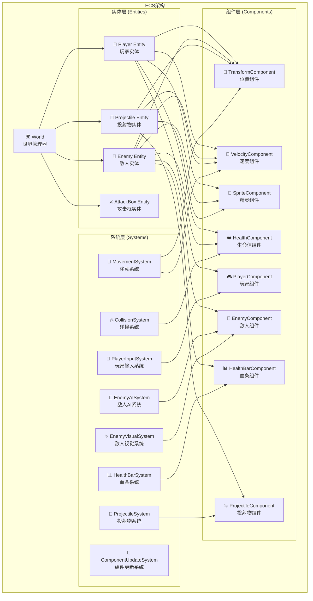
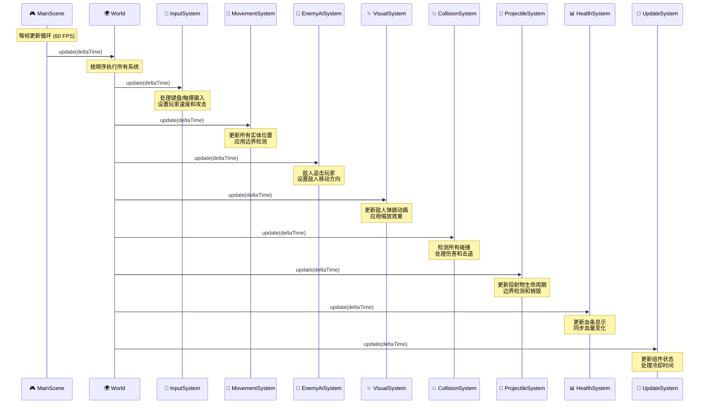
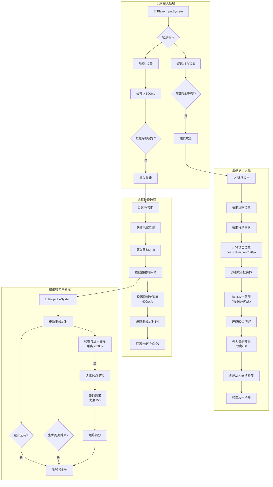
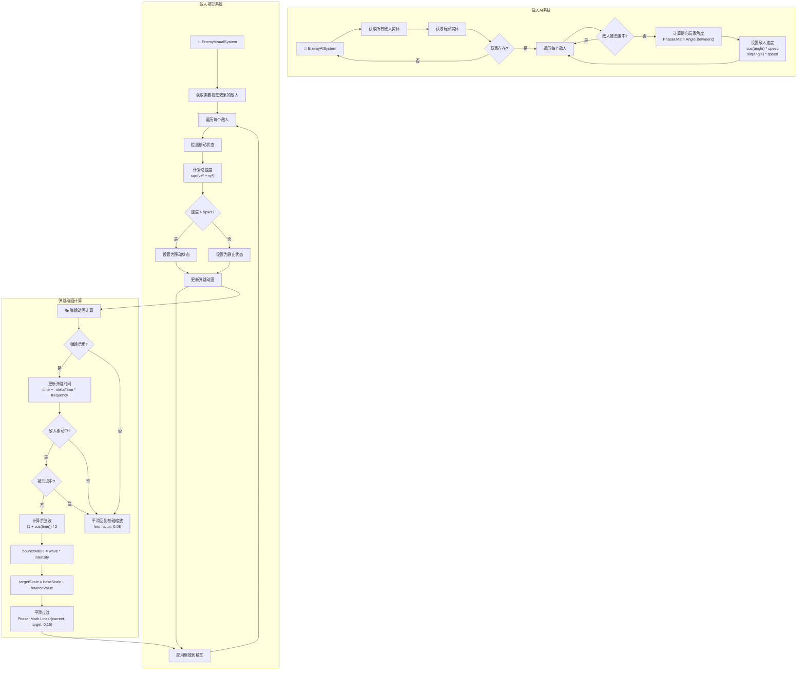
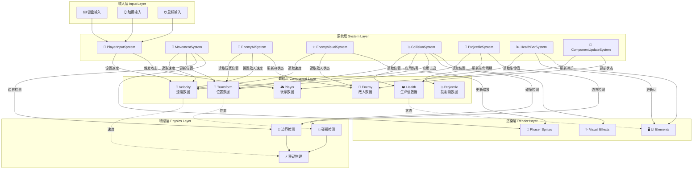
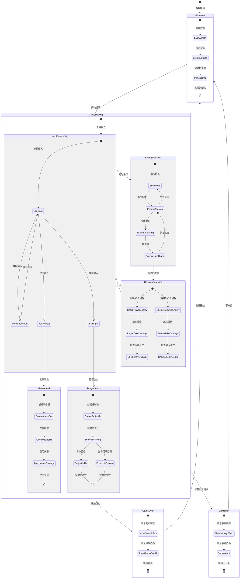

# 游戏架构设计文档

## 概述

本文档详细描述了基于Phaser.js和ECS（Entity-Component-System）架构的2D动作游戏的完整设计方案。游戏包含玩家控制、敌人AI、碰撞检测、攻击系统、视觉效果等核心功能模块。

## 目录

1. [整体ECS架构](#1-整体ecs架构)
2. [游戏主循环时序](#2-游戏主循环时序)
3. [碰撞检测系统](#3-碰撞检测系统)
4. [攻击判定系统](#4-攻击判定系统)
5. [敌人AI和视觉系统](#5-敌人ai和视觉系统)
6. [边界检测和移动系统](#6-边界检测和移动系统)
7. [数据流和系统依赖](#7-数据流和系统依赖)
8. [游戏状态机](#8-游戏状态机)
9. [技术规格](#9-技术规格)

---

## 1. 整体ECS架构

### 架构说明

**ECS架构优势**：
- **模块化设计**：每个系统专注单一职责
- **高可扩展性**：添加新功能只需新增组件或系统
- **数据驱动**：组件存储数据，系统处理逻辑
- **性能优化**：系统可以批量处理相同类型的实体

**核心实体类型**：
- `Player Entity`：玩家角色，包含移动、攻击、生命值等功能
- `Enemy Entity`：敌人实体，具有AI追击、弹跳动画、血条显示
- `Projectile Entity`：投射物实体，用于远程攻击
- `AttackBox Entity`：攻击判定框，用于近战攻击范围检测

---

## 2. 游戏主循环时序

### 执行顺序说明

**系统执行优先级**：
1. **输入系统**：最先处理用户输入，设置移动和攻击意图
2. **移动系统**：根据速度更新所有实体位置，应用边界检测
3. **AI系统**：敌人根据玩家位置计算追击方向
4. **视觉系统**：更新敌人弹跳动画和视觉效果
5. **碰撞系统**：检测各种碰撞并处理伤害
6. **投射物系统**：管理投射物生命周期和边界检测
7. **血条系统**：同步显示生命值变化
8. **更新系统**：处理冷却时间和其他状态更新

---

## 3. 碰撞检测系统

```mermaid
flowchart TD
    Start["🎯 CollisionSystem.update()"]
    
    subgraph "玩家-敌人碰撞检测"
        GetPlayer["获取玩家实体"]
        GetEnemies["获取所有敌人实体"]
        HasPlayer{"玩家存在?"}
        LoopEnemies["遍历每个敌人"]
        CalcDistance["计算距离<br/>Phaser.Math.Distance.Between()"]
        CheckCollision{"距离 < 30px?"}
        CheckInvincible{"玩家无敌?"}
        ApplyDamage["对玩家造成伤害<br/>设置无敌时间1秒"]
        CreateEffects["创建受伤特效<br/>屏幕震动+光晕护盾"]
        ApplyKnockback["应用击退效果"]
        CheckDeath{"玩家死亡?"}
        PlayerDeath["触发玩家死亡事件"]
    end
    
    subgraph "投射物-敌人碰撞检测"
        GetProjectiles["获取所有投射物"]
        GetEnemies2["获取所有敌人实体"]
        LoopProjectiles["遍历每个投射物"]
        ValidateComponents{"组件完整?"}
        LoopEnemies2["遍历每个敌人"]
        ValidateEnemyComp{"敌人组件完整?"}
        CalcProjDistance["计算投射物-敌人距离"]
        CheckProjCollision{"距离 < 20px?"}
        ApplyProjDamage["对敌人造成伤害<br/>忽略无敌帧"]
        ApplyEnemyKnockback["应用敌人击退"]
        CreateEnemyEffects["创建敌人受伤特效"]
        CreateHitEffect["创建投射物命中特效"]
        MarkProjectile["标记投射物待删除"]
        CheckEnemyDeath{"敌人死亡?"}
        EnemyDeath["触发敌人死亡事件"]
        RemoveProjectiles["批量删除投射物"]
    end
    
    Start --> GetPlayer
    GetPlayer --> HasPlayer
    HasPlayer -->|是| GetEnemies
    HasPlayer -->|否| GetProjectiles
    GetEnemies --> LoopEnemies
    LoopEnemies --> CalcDistance
    CalcDistance --> CheckCollision
    CheckCollision -->|是| CheckInvincible
    CheckCollision -->|否| LoopEnemies
    CheckInvincible -->|否| ApplyDamage
    CheckInvincible -->|是| LoopEnemies
    ApplyDamage --> CreateEffects
    CreateEffects --> ApplyKnockback
    ApplyKnockback --> CheckDeath
    CheckDeath -->|是| PlayerDeath
    CheckDeath -->|否| LoopEnemies
    PlayerDeath --> GetProjectiles
    
    GetProjectiles --> LoopProjectiles
    LoopProjectiles --> ValidateComponents
    ValidateComponents -->|是| LoopEnemies2
    ValidateComponents -->|否| LoopProjectiles
    LoopEnemies2 --> ValidateEnemyComp
    ValidateEnemyComp -->|是| CalcProjDistance
    ValidateEnemyComp -->|否| LoopEnemies2
    CalcProjDistance --> CheckProjCollision
    CheckProjCollision -->|是| ApplyProjDamage
    CheckProjCollision -->|否| LoopEnemies2
    ApplyProjDamage --> ApplyEnemyKnockback
    ApplyEnemyKnockback --> CreateEnemyEffects
    CreateEnemyEffects --> CreateHitEffect
    CreateHitEffect --> MarkProjectile
    MarkProjectile --> CheckEnemyDeath
    CheckEnemyDeath -->|是| EnemyDeath
    CheckEnemyDeath -->|否| LoopProjectiles
    EnemyDeath --> LoopProjectiles
    LoopProjectiles --> RemoveProjectiles
```

### 碰撞检测规格

**碰撞检测参数**：
- **玩家-敌人碰撞**：半径30像素，圆形检测
- **投射物-敌人碰撞**：半径20像素，圆形检测
- **碰撞算法**：使用`Phaser.Math.Distance.Between()`计算欧几里得距离

**伤害机制**：
- **敌人对玩家伤害**：考虑无敌帧，避免连续伤害
- **投射物对敌人伤害**：忽略无敌帧，立即生效
- **无敌时间**：玩家受伤后1秒无敌保护

**特效系统**：
- **玩家受伤**：青色护盾、屏幕震动、红色染色
- **敌人受伤**：橙红色闪烁、透明度变化
- **投射物命中**：爆炸特效、放射性火花

---

## 4. 攻击判定系统

### 攻击系统规格

**输入映射**：
- **键盘攻击**：空格键触发近战攻击
- **触摸攻击**：短按触发近战，长按(>500ms)触发技能
- **方向检测**：根据最后移动方向确定攻击方向

**近战攻击**：
- **攻击范围**：50像素半径
- **攻击伤害**：50点
- **击退力度**：200像素/秒
- **攻击位置**：玩家位置 + 方向 × 20像素偏移

**远程技能**：
- **投射物速度**：400像素/秒
- **投射物伤害**：30点
- **击退力度**：150像素/秒
- **生命周期**：3秒
- **技能冷却**：5秒

---

## 5. 敌人AI和视觉系统

### AI和视觉系统规格

**敌人AI行为**：
- **追击逻辑**：始终朝向玩家位置移动
- **角度计算**：使用`Phaser.Math.Angle.Between()`
- **击退响应**：被击退时停止追击行为
- **速度设置**：根据角度和移动速度设置X/Y分量

**弹跳动画系统**：
- **触发条件**：移动速度 > 5像素/秒
- **弹跳强度**：0.2 (20%缩放变化)
- **弹跳频率**：2.0 (0.5秒周期)
- **动画算法**：余弦波函数，范围[0.8, 1.0]
- **平滑过渡**：线性插值避免突兀变化

**状态管理**：
- **移动状态检测**：基于速度向量长度
- **击退状态优先级**：击退期间暂停弹跳
- **恢复机制**：静止时平滑回到基础缩放

---

## 6. 边界检测和移动系统

```mermaid
flowchart TD
    subgraph "移动系统边界检测"
        MoveStart["🚶 MovementSystem"]
        GetMovingEntities["获取所有移动实体<br/>(Transform + Velocity)"]
        LoopEntities["遍历每个实体"]
        ApplyFriction["应用摩擦力"]
        CalcNewPos["计算新位置<br/>newX = x + vx * deltaTime<br/>newY = y + vy * deltaTime"]
        CheckProjectile{"是投射物?"}
        ProjectilePath["投射物路径"]
        NonProjectilePath["非投射物路径"]
        UpdateProjPos["直接更新位置<br/>不做边界限制"]
        CheckBounds["边界检测"]
        ClampPosition["限制位置在边界内<br/>Math.max(min, Math.min(max, pos))"]
        CheckXBound{"X轴撞边界?"}
        CheckYBound{"Y轴撞边界?"}
        StopVX["停止X方向速度"]
        StopVY["停止Y方向速度"]
        UpdateSprite["更新精灵位置"]
    end
    
    subgraph "投射物边界检测"
        ProjSysStart["🚀 ProjectileSystem"]
        GetProjectiles["获取所有投射物"]
        LoopProjectiles["遍历每个投射物"]
        UpdateLifetime["更新生命周期"]
        CheckOutOfBounds["边界检测<br/>x < 0 || x > 800<br/>y < 0 || y > 600"]
        CheckExpired["检查是否过期<br/>lifetime >= maxLifetime"]
        RemoveEntity["销毁投射物实体"]
    end
    
    subgraph "边界定义"
        GameBounds["🎯 游戏边界"]
        PlayerBounds["👤 玩家/敌人边界<br/>X: [20, 780]<br/>Y: [20, 580]"]
        ProjectileBounds["🚀 投射物边界<br/>X: [0, 800]<br/>Y: [0, 600]"]
    end
    
    MoveStart --> GetMovingEntities
    GetMovingEntities --> LoopEntities
    LoopEntities --> ApplyFriction
    ApplyFriction --> CalcNewPos
    CalcNewPos --> CheckProjectile
    CheckProjectile -->|是| ProjectilePath
    CheckProjectile -->|否| NonProjectilePath
    
    ProjectilePath --> UpdateProjPos
    UpdateProjPos --> UpdateSprite
    
    NonProjectilePath --> CheckBounds
    CheckBounds --> ClampPosition
    ClampPosition --> CheckXBound
    CheckXBound -->|是| StopVX
    CheckXBound -->|否| CheckYBound
    StopVX --> CheckYBound
    CheckYBound -->|是| StopVY
    CheckYBound -->|否| UpdateSprite
    StopVY --> UpdateSprite
    UpdateSprite --> LoopEntities
    
    ProjSysStart --> GetProjectiles
    GetProjectiles --> LoopProjectiles
    LoopProjectiles --> UpdateLifetime
    UpdateLifetime --> CheckOutOfBounds
    CheckOutOfBounds -->|是| RemoveEntity
    UpdateLifetime --> CheckExpired
    CheckExpired -->|是| RemoveEntity
    RemoveEntity --> LoopProjectiles
    
    GameBounds --> PlayerBounds
    GameBounds --> ProjectileBounds
```

### 边界检测规格

**边界定义**：
- **游戏屏幕**：800×600像素
- **玩家/敌人活动区域**：[20,780] × [20,580]
- **投射物检测区域**：[0,800] × [0,600]

**系统职责分离**：
- **MovementSystem**：处理玩家和敌人的边界限制
- **ProjectileSystem**：专门处理投射物的边界检测和销毁
- **投射物特殊处理**：不受MovementSystem边界限制，可自由穿越边界后被销毁

**边界碰撞处理**：
- **位置限制**：使用`Math.max/min`限制在边界内
- **速度重置**：撞到边界时停止对应方向的速度
- **立即生效**：确保实体不会卡在边界上

---

## 7. 数据流和系统依赖

### 数据流分析

**数据层次结构**：
1. **输入层**：接收用户输入，转换为游戏指令
2. **系统层**：处理游戏逻辑，更新组件数据
3. **数据层**：存储游戏状态，组件化数据结构
4. **渲染层**：显示游戏画面，UI元素
5. **物理层**：处理物理计算，碰撞检测

**关键数据依赖**：
- **位置数据**：核心数据，被多个系统读取和修改
- **速度数据**：影响移动和碰撞计算
- **生命值数据**：决定实体存亡和UI显示
- **状态数据**：控制AI行为和视觉效果

---

## 8. 游戏状态机

### 状态转换说明

**游戏生命周期**：
1. **初始化阶段**：加载资源、创建实体、初始化系统
2. **游戏进行**：主要游戏循环，处理所有游戏逻辑
3. **结束状态**：游戏胜利或失败，显示结果界面

**核心状态循环**：
- **输入处理** → **实体行为** → **碰撞检测** → **下一帧**
- 每个状态都有明确的进入和退出条件
- 支持并发状态处理（如输入和AI同时进行）

---

## 9. 技术规格

### 核心技术栈

**游戏引擎**：
- `Phaser.js 3.x` - 2D游戏引擎
- `TypeScript` - 类型安全的JavaScript
- `Webpack` - 模块打包和热重载

**架构模式**：
- `ECS (Entity-Component-System)` - 数据驱动架构
- `Observer Pattern` - 事件系统
- `Factory Pattern` - 实体创建

### 性能规格

**帧率目标**：60 FPS
**分辨率**：800×600像素
**最大实体数量**：100+敌人同时处理
**内存占用**：< 100MB

### 系统参数

**碰撞检测**：
- 玩家-敌人：30px半径
- 投射物-敌人：20px半径
- 近战攻击：50px半径

**伤害数值**：
- 敌人对玩家：25点
- 近战攻击：50点
- 远程投射物：30点

**移动速度**：
- 玩家速度：200px/s
- 敌人速度：100px/s
- 投射物速度：400px/s

**冷却时间**：
- 攻击冷却：200ms
- 技能冷却：5000ms
- 无敌时间：1000ms

**边界设置**：
- 游戏区域：800×600
- 玩家/敌人：[20,780]×[20,580]
- 投射物：[0,800]×[0,600]

### 扩展性设计

**模块化组件**：
- 新增实体类型只需添加对应组件
- 新增系统不影响现有逻辑
- 支持运行时动态添加/移除实体

**配置化参数**：
- 所有数值参数可外部配置
- 支持不同难度级别
- 易于平衡性调整

**事件驱动**：
- 松耦合的事件通信
- 易于添加新的游戏机制
- 支持复杂的状态依赖

---

## 总结

本架构设计实现了一个完整、可扩展的2D动作游戏系统。通过ECS架构确保了代码的模块化和可维护性，详细的流程图和状态机保证了系统的可理解性和调试便利性。

**核心优势**：
- 🏗️ **模块化设计**：清晰的职责分离
- ⚡ **高性能**：优化的碰撞检测和批量处理
- 🎨 **丰富特效**：完整的视觉反馈系统
- 🔧 **易于扩展**：支持快速添加新功能
- 📊 **数据驱动**：参数化配置，易于调整平衡性

该架构为后续的功能扩展（如多种敌人类型、技能系统、关卡设计等）提供了坚实的基础。 